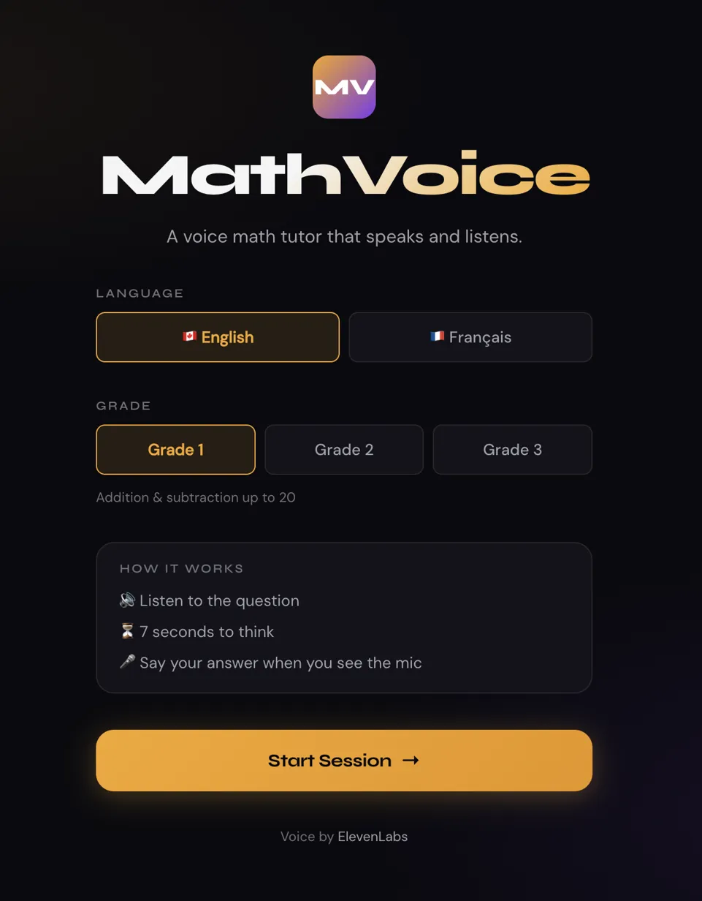

# MathVoice Web 🎙️✖️➕

**A bilingual EN/FR voice math tutor for Grade 1–3, powered by ElevenLabs.**

Live demo: [mathvoice-web.vercel.app](https://mathvoice-web.vercel.app)



MathVoice runs entirely in the browser. No app to install. No downloads.
ElevenLabs voices the questions. The Web Speech API listens for answers.
The child speaks. MathVoice responds.

> **⚠️ Chrome only.** The Web Speech API used for microphone input is not supported in Firefox or Safari. Open in Chrome for the full experience.

> **⚠️ Credit limit.** The live demo runs on a free-tier ElevenLabs API key with limited monthly credits. If voice output is silent, credits may be exhausted — the app falls back to browser TTS automatically. To run with your own key, see [Deploy to Vercel](#deploy-to-vercel) below.

---

## How It Works
```
User hits Start
       ↓
Browser requests microphone permission
       ↓
ElevenLabs TTS voices the greeting (eleven_multilingual_v2)
       ↓
ElevenLabs TTS voices the math question
       ↓
7-second countdown ring — reflection time
       ↓
2-second capture window — mic active, Web Speech API listens
       ↓
Answer parsed → compared → ElevenLabs TTS voices feedback
       ↓
Repeat for 5 questions → voiced score summary
```

The mic is only active during the 2-second capture window. This keeps credit usage minimal and reduces false triggers.

---

## Demo

1. Choose English or French
2. Choose your grade (1, 2, or 3)
3. Hit Start — browser asks for mic permission, then MathVoice greets you
4. Listen to the question, watch the 7-second countdown
5. Say your answer when you see the 🎤 icon
6. Get instant voiced feedback — encouragement or gentle correction
7. 5 questions, then a voiced score summary

---

## Architecture
```
Browser
  ├── ElevenLabs REST API  →  TTS voice output
  │     └── eleven_multilingual_v2, EN + FR
  └── Web Speech API       →  Speech-to-text input (browser native)
        └── 2-second active capture window per question

No backend. No database. Stateless session.
API key lives client-side (NEXT_PUBLIC_). See security note below.
```

**Graceful fallback:** If no API key is set or credits are exhausted, MathVoice falls back to the browser's built-in Web Speech synthesis — lower voice quality but fully functional.

**Security note:** For this demo, the ElevenLabs API key is client-side (`NEXT_PUBLIC_`). For a production deployment, proxy TTS requests through a Next.js API route (`/api/tts`) to keep the key server-side and rate-limit by user.

---

## Deploy to Vercel

**Step 1 — Fork or clone**
```bash
git clone https://github.com/Moezusb/mathvoice-web.git
cd mathvoice-web
```

**Step 2 — Import on Vercel**
- Go to [vercel.com/new](https://vercel.com/new)
- Import your GitHub repo
- Under **Environment Variables**, add:
  - Key: `NEXT_PUBLIC_ELEVENLABS_API_KEY`
  - Value: your ElevenLabs API key ([get one here](https://elevenlabs.io/app/settings/api-keys))
  - Grant **Text to Speech → Access** only — no other permissions needed
- Click **Deploy**

Vercel auto-detects Next.js. No build configuration required.

---

## Run Locally
```bash
npm install
cp .env.local.example .env.local
# Add your ElevenLabs API key to .env.local
npm run dev
```

Open [http://localhost:3000](http://localhost:3000) in Chrome.

---

## Grade Difficulty

| Grade | Operations | Range |
|-------|-----------|-------|
| 1 | Addition, subtraction | Numbers 1–20 |
| 2 | Addition, subtraction, multiplication (×2, ×5, ×10) | Up to 100 |
| 3 | All operations | Multiplication up to 10×10 |

---

## Why ElevenLabs

Voice quality is the product for a child learning to listen and respond. Robotic TTS breaks engagement in seconds. ElevenLabs' `eleven_multilingual_v2` model delivers:

- **Natural pacing and warmth** — children lean in rather than tune out
- **Native-quality French** — not translated English with a French accent
- **Emotional expressiveness** — encouragement sounds like encouragement

The bilingual EN/FR capability reflects a real deployment need: French-first learners in Quebec, West Africa, and across the Francophone world deserve the same quality of voice interaction as English-speaking children.

---

## Built by

**Mohamed Bah** — [moezusb.github.io](https://moezusb.github.io) · [LinkedIn](https://linkedin.com/in/mohamedmoezus)

*"Great science is artistic at its core."*
